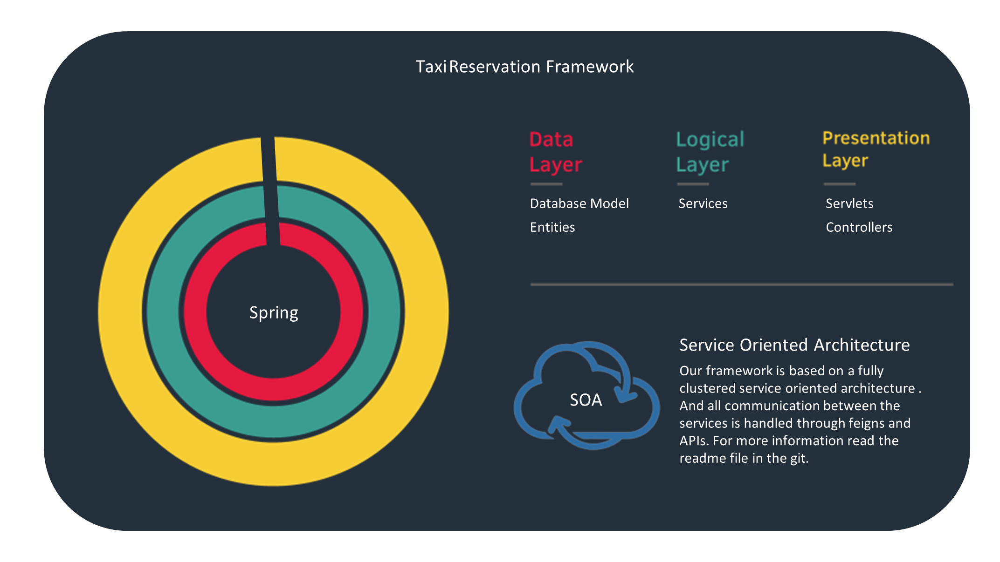

# Taxi Booking Framework

Simple software architectures project to design a taxi booking framework.

# Table of Contents

- [Team Members](#team-members)
- [Description](#description)
  - [Prioritised Feature List](#prioritised-feature-list)
  - [Framework Architecture](#framework-architecture)
    - [Framework Services](#framework-services)
  - [Component, and Class Diagram](#component-and-class-diagram)

# Team Members

- Farbod Nazari Montazer
- Mahshad Salimi
- Amin Hassan Zarei
- Taha Khani Almoti

# Description

The prerequisites to designing the framework as requested by the projects are defined as follows.

## Prioritised Feature List

A defined ranked list of features required for a basic taxi reservation system with a description.

<center>

| Priority |                 Feature                 |                                                                                                            Description                                                                                                             |
| :------: | :-------------------------------------: | :--------------------------------------------------------------------------------------------------------------------------------------------------------------------------------------------------------------------------------: |
|    1     |           Booking Management            |                          Taxi availability search <br> Taxi selection based on criteria (e.g., location, type) <br> Pickup and drop-off location selection <br> Confirmation and cancellation of bookings                          |
|    2     |            Taxi Dispatching             |                                                                              Assigning nearest available taxi to passenger <br> Dispatching algorithm                                                                              |
|    3     |            Fleet Management             |                Vehicle registration and management <br> Real-time tracking of vehicle locations <br> Vehicle availability status management <br> Vehicle maintenance scheduling <br> Optimizing vehicle utilization                |
|    4     |  User Registration and Authentication   |                                                                   User registration (passengers and drivers) <br> Login authentication (passengers and drivers)                                                                    |
|    5     |            Driver Management            | Driver registration and onboarding <br> Availability status management <br> Booking assignment to drivers <br> Real-time location tracking of driversReal-time location tracking of drivers <br> Navigation assistance for drivers |
|    6     |           Payment Processing            |                        Multiple payment method support (debit cards, cash) <br> Fare calculation based on distance, time, and additional charges <br> Invoice generation <br> Refunds and dispute handling                         |
|    7     |         Notification Management         |              Booking confirmation notifications <br> Driver assignment notifications <br> Estimated arrival time notifications <br> Ride completion notifications <br> Payment confirmation notifications to drivers               |
|    8     |           Profile Management            |                                                 User profile creation and editing (passengers and drivers) <br> Driver document verification (e.g., license, vehicle registration)                                                 |
|    9     |       Feedback and Rating System        |                                                                  Passenger rating of drivers <br> Driver rating of passengers <br> Feedback submission for rides                                                                   |
|    10    |             Admin Dashboard             |                                  System configuration management <br> Handling user complaints/disputes <br> Managing driver accounts <br> Generating reports and analytics <br> Feedback review                                   |
|    11    |         Analytics and Reporting         |                                      System performance analytics <br> User behavior analytics <br> Booking trend analysis <br> Driver productivity analysis <br> Revenue generation reports                                       |
|    12    |        Promotions and Discounts         |                                                  Generating and applying promotion codes <br> Offering discounts for specific users or rides <br> Managing promotional campaigns                                                   |
|    13    | Localization and Multi-language Support |                                                                    Supporting multiple languages for users <br> Localization of content based on user location                                                                     |
|    14    |         Accessibility Features          |                                                                       Support for visually impaired users <br> User interface adjustments for accessibility                                                                        |
|    15    |    Regulatory Compliance Enforcement    |                                                                             Compliance with local transportation regulations <br> Fine for bad actors                                                                              |
|    16    |   Integration with External Services    |                                                Integration with mapping services (e.g., Google Maps) <br> Integration with bank payment gateways <br> Integration with sms services                                                |

</center>

## Framework Architecture

The framework is designed using a service oriented architecture with each service using a layered architecture, with a focus on scalability and adaptability.

<p align="center">
  
</p>

# createPromotion

Used to create Promotion

**URL** : `/api/promotion/create`

**Method** : `POST`

> Input
>
> ```json
> {
>   "id": 1,
>   "code": "93144b288eb1fdccbe46d6fc0f241a51766ecd3d",
>   "description": "test",
>   "discountPercentage": 10,
>   "startDate": "2024-05-05",
>   "endDate": "2024-08-09"
> }
> ```

> Response
>
> ```json
> {
>   "code": "93144b288eb1fdccbe46d6fc0f241a51766ecd3d",
>   "description": "test",
>   "discountPercentage": 10,
>   "startDate": "2024-05-05",
>   "endDate": "2024-08-09"
> }
> ```

# updatePromotion

Used to update Promotion

**URL** : `/api//update/{id}`

**Method** : `PUT`

> Input
>
> ```json
> {
>   "code": "93144b288eb1fdccbe46d6fc0f241a51766ecd3d",
>   "description": "test",
>   "discountPercentage": 10,
>   "startDate": "2024-05-05",
>   "endDate": "2024-08-09"
> }
> ```

> Response
>
> ```json
> {
>   "code": "93144b288eb1fdccbe46d6fc0f241a51766ecd3d",
>   "description": "test",
>   "discountPercentage": 10,
>   "startDate": "2024-05-05",
>   "endDate": "2024-08-09"
> }
> ```

# deletePromotion

Used to delete Promotion

**URL** : `/delete/{id}`

**Method** : `Delete`

> Input
>
> ```json
> {}
> ```

> Response
>
> ```json
> {}
> ```

# getPromotionById

Used to get Promotion by id

**URL** : `/{id}`

**Method** : `GET`

> Input
>
> ```json
> {}
> ```

> Response
>
> ```json
> {
>   "id": 1,
>   "code": "93144b288eb1fdccbe46d6fc0f241a51766ecd3d",
>   "description": "test",
>   "discountPercentage": 10,
>   "startDate": "2024-05-05",
>   "endDate": "2024-08-09"
> }
> ```

# getPromotionByCode

Used to get Promotion by code

**URL** : `/code/{code}`

**Method** : `GET`

> Input
>
> ```json
> {}
> ```

> Response
>
> ```json
> {
>   "id": 1,
>   "code": "93144b288eb1fdccbe46d6fc0f241a51766ecd3d",
>   "description": "test",
>   "discountPercentage": 10,
>   "startDate": "2024-05-05",
>   "endDate": "2024-08-09"
> }
> ```

# getAllPromotions

Used to get all Promotion

**URL** : `/all`

**Method** : `GET`

> Input
>
> ```json
> {}
> ```

> Response
>
> ```json
> {
>   [
>    "id":1,
>    "code": "93144b288eb1fdccbe46d6fc0f241a51766ecd3d",
>    "description":"test",
>    "discountPercentage":10,
>    "startDate":"2024-05-05",
>    "endDate":"2024-08-09"
>   ]
> }
> ```

# applyPromotionToBooking

Used to apply Promotion To Booking

**URL** : `/apply/{promotionCode}`

**Method** : `POST`

> Input
>
> ```json
> {
>   "userId": 1,
>   "longitude": 2.5,
>   "latitude": 2.0,
>   "destLongitude": 10,
>   "destLatitude": "22",
>   "price": 5.5,
>   "promotionCode": "aaarjlheuioh99879"
> }
> ```

> Response
>
> ```json
> {
>     20
> }
> ```

# assignPromotionToUser

Used to assign Promotion To User

**URL** : `/assign`

**Method** : `POST`

> Input
>
> ```json
> {
>   "userId": 1,
>   "promotionId": 5
> }
> ```

> Response
>
> ```json
> {
>   "id": 5,
>   "userId": 1,
>   "promotionId": "aaarjlheuioh99879",
>   "isUsed": false
> }
> ```

# updateAssignedPromotionToUser

Used to Update assign Promotion To User

**URL** : `/update-assignment/{id}`

**Method** : `PUT`

> Input
>
> ```json
> {
>   "userId": 1,
>   "promotionId": 5,
>   "isUsed": false
> }
> ```

> Response
>
> ```json
> {
>   "id": 5,
>   "userId": 1,
>   "promotionId": "aaarjlheuioh99879",
>   "isUsed": false
> }
> ```

# removePromotionFromUser

Used to remove Promotion From User

**URL** : `/remove-assignment/{id}`

**Method** : `DELETE`

> Input
>
> ```json
> {}
> ```

> Response
>
> ```json
> {}
> ```

# getUserPromotions

Used to get User Promotion

**URL** : `/user/{userId}`

**Method** : `GET`

> Input
>
> ```json
> {}
> ```

> Response
>
> ```json
> {
>   "id": 5,
>   "userId": 1,
>   "promotionId": "aaarjlheuioh99879",
>   "isUsed": false
> }
> ```

# getUserPromotionById

Used to get User Promotion by id

**URL** : `/user-promotion/{id}`

**Method** : `GET`

> Input
>
> ```json
> {}
> ```

> Response
>
> ```json
> {
>   "id": 5,
>   "userId": 1,
>   "promotionId": "aaarjlheuioh99879",
>   "isUsed": false
> }
> ```

### Framework Services:

#### [Booking Service](portal/framework/src/main/java/com/taxi/framework/booking)

> Handles bookings made by users, manages assignments, states of the user, and assigned driver's location.

#### [Dispatching Service](portal/framework/src/main/java/com/taxi/framework/dispatch)

> Handles finding users based on proximity to the driver, using the locations from fleet management.

#### [Fleet Management Service](portal/framework/src/main/java/com/taxi/framework/fleet)

> Handles drivers registered and looking for users, keeps an updated location of each driver.

#### [Pricing Service](portal/framework/src/main/java/com/taxi/framework/pricing)

> Handles pricing calculation for a user based on different variables like traffic, rain, and distance.

#### [User Service](portal/framework/src/main/java/com/taxi/framework/user)

> Pre-made endpoints, DTOs, and service interface for user management.

#### [Discount Service](portal/framework/src/main/java/com/taxi/framework/Discount)

> Handles Discount and promotions for user and booking

## Component, and Class Diagram

To view the enforced architecture diagram please check the UML.drawio file inside the repository (The classes provided by the framework are colored blue, while the classes that are supposed to be made by the developer are coloured purple).
